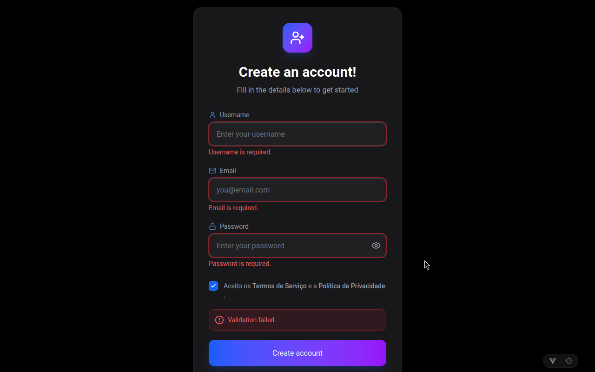
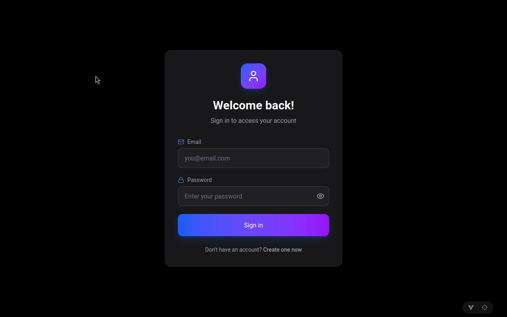
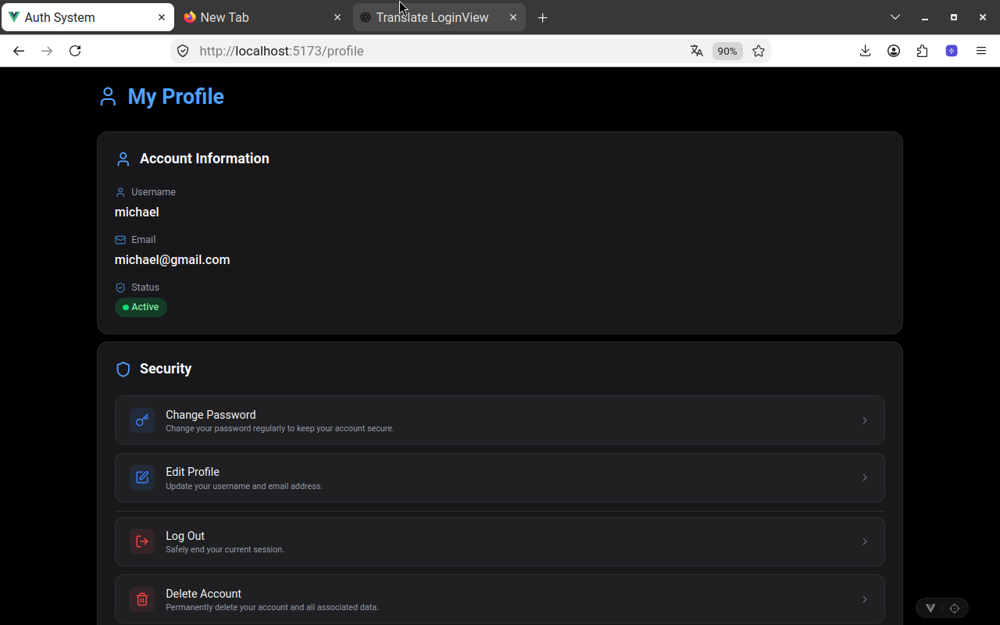

<h1 align="center" style="font-weight: bold;">Auth System Frontend</h1>

<p align="center">
  <a href="#tech">Technologies</a> •
  <a href="#started">Getting Started</a> •
  <a href="#structure">Project Structure</a> •
  <a href="#api">API Integration</a>
</p>

<p align="center">
  Frontend interface for an Auth System application built with Vue.js.
</p>

<p align="center">
  
  <br><br>
  
  <br><br>
  
</p>

<h2 id="tech">💻 Technologies</h2>

This project was developed using the following technologies:

* Vue.js
* TypeScript
* Vite
* Pinia
* Tailwind CSS
* Axios

<h2 id="started">🚀 Getting Started</h2>

Follow the instructions below to run the project locally.

<h3>Prerequisites</h3>

Make sure you have installed:

* Node.js
* npm
* Git

<h3>Cloning</h3>

Clone the repository:

```bash
git clone https://github.com/agideev/auth-system.git
```

Enter the project directory:

```bash
cd auth-system/frontend
```

<h3>Installing Dependencies</h3>

Install the project dependencies:

```bash
npm install
```

<h3>Environment Variables</h3>

Create a `.env` file in the root directory of the project:

```env
VITE_API_URL=http://localhost:5000/api
```

> Adjust the API URL according to the address where your backend is running.

<h3>Starting</h3>

Start the development server:

```bash
npm run dev
```

After starting the server, Vite will provide a local URL, usually:

```text
http://localhost:5173
```

<h2 id="structure">📁 Project Structure</h2>

A simplified structure of the project:

```text
frontend/
│
├── public/
│
├── src/
│   ├── assets/
│   │
│   ├── components/
│   │   ├── profile/
│   │   ├── modals/
│   │   ├── ui/
│   │   └── ...
│   │
│   ├── views/
│   │   ├── RegisterView.vue
│   │   ├── LoginView.vue
│   │   └── ...
│   │
│   ├── services/
│   │   ├── auth.ts
│   │   └── api.ts
│   │
│   ├── App.vue
│   ├── main.ts
│   │   └── ...
│
│
├── .env
├── .env.example
├── .gitignore
├── index.html
├── package.json
├── package-lock.json
└── README.md
```

<h2 id="api">Routes</h2>

Route       | Page                                           |
----------- | ---------------------------------------------- |
`/register` | Create Account                                 |
`/login`    | Authenticate a user                            |
`/profile`  | User Profile                                   |

<h2 id="api">🔌 API Integration</h2>

The frontend communicates with the backend through an HTTP API.

### Authentication

| Method | Endpoint    | Description                                    |
| ------ | ----------- | ---------------------------------------------- |
| `POST` | `/register` | Register a new user                            |
| `POST` | `/login`    | Authenticate a user and return an access token |

### User

| Method | Endpoint       | Description                              |
| ------ | -------------- | ---------------------------------------- |
| `GET`  | `/me`          | Get the authenticated user's profile     |
| `PUT`  | `/me`          | Update the authenticated user's profile  |
| `PUT`  | `/me/password` | Change the authenticated user's password |

### JWT Authentication

Protected endpoints require a valid JWT access token:

```http
Authorization: Bearer <access_token>
```

<h2>🔐 Authentication & Profile Features</h2>

The application provides a simple and responsive interface for user authentication and profile management.

Current features include:

* User registration
* User login
* User logout
* Profile management and updates
* Password change
* Form validation and error handling
* Loading states while processing requests
* Success and error feedback messages
* Responsive interface for different screen sizes
* Backend API integration
* Authentication using JWT tokens

<h2>🛠️ Available Scripts</h2>

Run the development server:

```bash
npm run dev
```

Build the application for production:

```bash
npm run build
```

Preview the production build:

```bash
npm run preview
```

<h2>📦 Production</h2>

To generate the production build:

```bash
npm run build
```

The generated files will be available in the:

```text
dist/
```

directory.

<h2>🔗 Backend</h2>

This application requires the Auth System Backend API to handle user authentication and account management.

The backend is responsible for:

* User registration
* User authentication and login
* JWT token generation and validation
* User profile management
* Password changes
* Authentication and authorization
* Request validation
* Error handling

Make sure the backend API is running before using the application locally. The frontend communicates with the backend through REST API endpoints.


<h2>🤝 Contributing</h2>

Contributions are welcome.

To contribute:

```bash
# Fork the repository

# Create a new branch
git checkout -b feature/my-feature

# Make your changes

# Commit your changes
git commit -m "feat: add new feature"

# Push your branch
git push origin feature/my-feature
```

Then open a Pull Request explaining the problem solved or feature implemented.

<h2>📄 License</h2>

This project is available for educational and development purposes.
